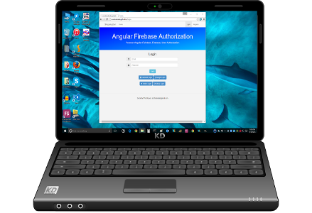
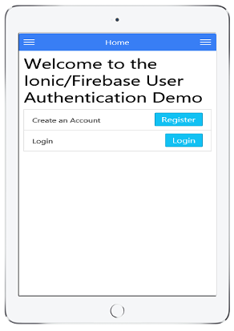

<h1>User Authorization Apps</h1>

   
    

      
      
      &nbsp;&nbsp;&nbsp;
      
    

   

  <h2>What Do These Apps Do</h2>
    <h4>
      

        This repository is a collection of four apps that demonstrate the use of user authorization
        to access a database.  Three apps share a common Firebase database, and if you register
        in one app, you can use the same login in the other apps.  There is a web version, an
        Android version, and an apple (iPad/iPhone) version.  The other app uses MongoDB
        for the database.  It is a MEAN (Mongo DB, Express, Angular JS, Node JS) stack app.
      

    </h4>
    
  <h2>What Features Do These Apps Have</h2>
    <h4>
      <ol>
        <li>Register an Account with E-Mail/Password</li>
        <li>Login using E-Mail/Password</li>
        <li>Login user social media (Facebook, Google, Twitter, Github)</li>
        <li>Change Password for your E-Mail/Password account</li>
        <li>Modify the menu system if logged in/logged out</li>
      </ol>
    </h4>

  <h2>Getting The Apps</h2>
    <h4>
      

        This app is available four ways:
      

      <ol>
        <li>
          
          On the <a href="http://scottnakada.github.io/UserAuth/yoFireAuth/dist/client/index.html">web</a>:  
        </li>
        <li>
          
          On the <a href="https://yomongoauth.herokuapp.com/index.html">web</a>:  
        </li>
        <li>
          
          On Android devices through the
          <a href="http://www.amazon.com/Ionic-Firebase-User-Authentication-App/dp/B014LUR2HI/ref=sr_1_1?s=mobile-apps&ie=UTF8&qid=1440823545&sr=1-1&keywords=ionFireAuth">
            Amazon Apps Store
          </a>.
        </li>
        <li>
          
          On Apple devices (iPhone/iPad), by downloading an app called Ionic View, and selecting the
          app id: <a href="http://scottnakada.github.io/UserAuth/index.html#ios">43FF8114</a>. See the next section for directions
          to try the app.  
        </li>
      </ol>
    </h4>
